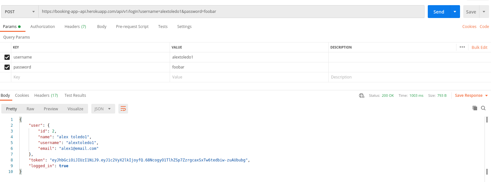
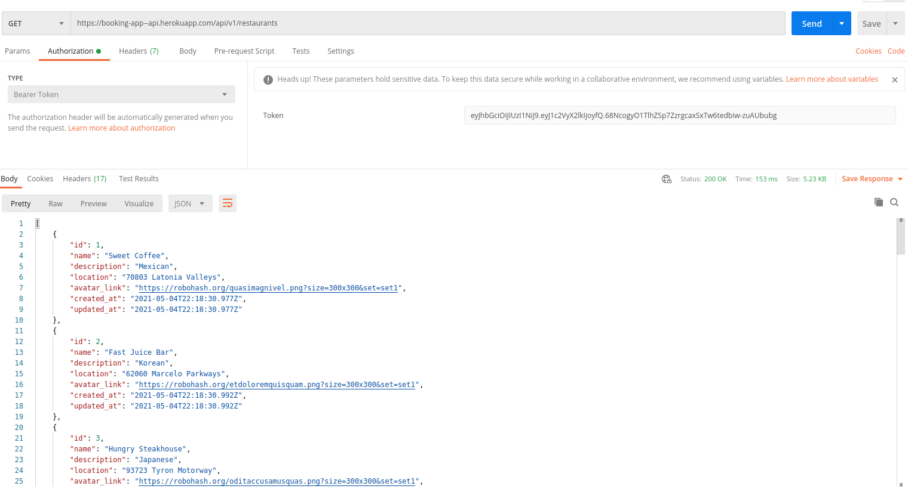

# RestAPI for a Application to Book an appointment

This back-end part of the final casptone project have the purpose to create a database of different types of restaurants, give the ability to the front end to create users and authenticate a old user and also, as I said before the funcionality to user to book and appointment to the Restuarant of their choice.

## Built With

- Ruby
- Ruby on Rails
- Rspec
- JWT
- Heroku

## Core Functionalities

User authentication: allows new user to register and existing users to login.
Fetch a list of Resturants: enables users to view available restaurants and their individual details.
Fetch a list of Appointments: enables users to view existing appointments (upcomig and past).
Create new appointment: allows users to book a new appointment.

## Getting Started

To get a local copy up and follow these simple example steps.

### Prerequisites

- Local Machine installed `Ruby` and `rails gem`
- A code editor as Visual Studio, Sublime,etc.

### Setup

Please make a local copy of this repo by typing this command on your terminal.
`git clone https://github.com/alejandrotoledoweb/booking-api-back-end.git`

Then, go to the folder created with this command:
`cd booking-api-back-end`

`bundle install` to install all necessary dependencies.

`rails db:create` && `rails db:migrate` to create database and tables.

`rails db:seed` to populate database with default data.

`rails s` to start the application. You're all set. Feel free to use POSTMAN or any other similar infrastructure to test the different endpoints.

To run test suites included, run:

`bundle exec rspec`

API Documentation
The base URL for all endpoints is `https://booking-app--api.herokuapp.com/api/v1`.

Summary of Available API Endpoints

Endpoint	Feature	Authentication
POST /users	Registers a new user	False
POST /login	Logs in a user	False
GET /autologin	Checks login status of the current user	True
POST /appointments	Creates a new appointment	True
GET /appointments	Fetches all available appointment for logged user	True
GET /restaurants	Fetches all available restaurants	False
GET /restaurants/:id	Fetches the details of a specific restaurant	False
DELETE /logout	Logs out a user	False
Sampling a request that requires authentication

POST Request (from POSTMAN):

GET Request (from POSTMAN):

Deployment
This app was deployed to Heroku and is accessible at: https://boiling-basin-10755.herokuapp.com

 ## Author

👤 **Alejandro Toledo**

- GitHub: [@alejandrotoledoweb](https://github.com/alejandrotoledoweb)
- Twitter: [@alejot](https://twitter.com/alejot) 
- LinkedIn: [Alejandro Toledo](https://www.linkedin.com/in/alejandro-toledo-freire/) 

## 🤝 Contributing

Contributions, issues and feature requests are welcome!

Feel free to check the [issues page](issues/).

## Show your support

Give a ⭐️ if you like this project!

## 📝 License

This project is [MIT](https://opensource.org/licenses/MIT) licensed.